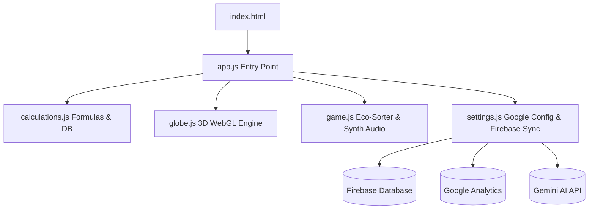

# EcoLoop | Gamified Carbon Footprint Tracker

EcoLoop is a premium, high-fidelity Progressive Web Application (PWA) designed to calculate, track, and reduce daily carbon footprints. The application combines advanced mathematical emission logic with an interactive WebGL eco-sphere particle globe, an educational sorting game with real-time Firebase syncing, and dynamic screen-reader accessibility (WCAG 2.1 compliant).

---

## 🍃 Chosen Vertical
**Environmental Sustainability & Climate Action**
- **Core Focus**: Individual emission accounting, gamified climate education, localized green actions commitments, and carbon budget tracking aligned with global climate targets (e.g., the Paris Agreement).

---

## 🛠️ Approach & Architectural Logic

EcoLoop utilizes a modern **Modular Pure ESM (ECMAScript Modules)** architecture without the weight or security vulnerabilities of bundlers or compilers.



### Key Pillars:
1. **Pure Separation of Concerns**:
   - `calculations.js`: Contains frozen constant databases, EPA/DEFRA emission coefficients, and functional, pure calculation math.
   - `globe.js`: Orchestrates the WebGL particle sphere, rotation physics, and high-DPI canvas scaling.
   - `game.js`: Controls the Sorter game, sound effects synthesis, and particle triggers.
   - `settings.js`: Manages configuration, API keys, and dynamic script injections.
2. **Dynamic Google Cloud & Firebase Integration**:
   - Integrates Google Maps API, Google Analytics, and Gemini AI.
   - Utilizes Firebase Realtime Database for live global scoreboards, fetching and syncing player metrics in real-time.
3. **Defensive Programming**:
   - Implements strict, range-clamping value parsers and sanitizers to guarantee type-safety and eliminate `NaN` calculations under malformed or empty state configurations.
   - Restricts XSS payloads inside stored fields.
   - Implements strict runtime sanitization checks using a dedicated input sanitizer module (`sanitizeInput`) when reading state configurations (profile names, scores, and log entries) from `localStorage` on boot to prevent persistent XSS injection vectors.
4. **Offline PWA Support**:
   - Registered under standard Service Worker caches using versioned updates, bypassing cache deadlocks for root updates while ensuring offline play compatibility for game libraries.
5. **Rendering & Computation Efficiency**:
   - **Dynamic Animation Lifecycle Loop**: Shuts down the Three.js WebGL particle sphere requestAnimationFrame loop completely when the user navigates away from the dashboard tab, eliminating unnecessary GPU/CPU workload.
   - **Deferred Chart.js Redraws**: Postpones rendering changes to the carbon breakdown doughnut and trend line charts when the user modifies inputs on the calculator wizard, only redrawing canvases when the dashboard tab is active and visible.

---

## 🚀 How the Solution Works

### 1. Dashboard & Carbon Budget Tracker
- Displays your net annual footprint in Tons CO₂e/yr via an interactive SVG circular gauge.
- **Daily Carbon Budget Tracker**: Compiles your net daily emissions and plots them against the target Paris Agreement limit of **11.0 kg/day**. The gauge changes from Green to Amber to Coral if you exceed your daily threshold.

### 2. Multi-Step Carbon Calculator Wizard
- Guides users through four detailed categories:
  - **Energy**: Region-specific electrical grid intensities (e.g., California vs. Coal-intensive Midwest) and green grid mix offsets.
  - **Transportation**: Vehicle mileage, fuel efficiency types (Gasoline, Hybrid, EV), and flights.
  - **Diet & Groceries**: Grocery purchase items (Beef, Poultry, Dairy, Vegetables) translated into weekly footprints.
  - **Lifestyle**: Shopping habits and recycling offsets.

### 3. Eco-Sorter Mini-Game
- An interactive game where users sort items (e.g., "Beef Steak", "Thrift Coat") into Low, Medium, or High carbon categories.
- Features **Web Audio API Sound Synthesis** (no audio file downloads required) for correct/incorrect actions, dynamic leaf particle chimes, and **Keyboard Access hooks** (Arrow keys or 1/2/3 keys).
- Syncs high scores with a global Firebase database.

### 4. Action Plan Checklist
- A localized list of commit items (e.g., "Meat-Free Mondays", "Cold Water Wash"). Committing to actions automatically deducts the respective carbon weight from your net footprint and rewards XP.

---

## 📋 Any Assumptions Made

1. **Emission Factors (EPA & DEFRA averages)**:
   - **Grid Electricity**: US Average Grid is set to `0.38 kg/kWh`. California is optimized at `0.22 kg/kWh`.
   - **Transportation**: Gasoline car emissions are assumed at `0.35 kg/mile`; EV emissions are set at `0.08 kg/kWh` equivalent.
   - **Flights**: Average commercial flight footprint is mapped to `120 kg CO₂ per hour`.
2. **Paris Accord Daily Target**:
   - The individual daily target limit is modeled at `11.0 kg/day`, matching calculations targeting a 1.5°C global warming limit.
3. **Offset Valuations**:
   - Projects are simulated with reasonable standard offsets valuation pricing ($15.00/Ton for Amazon Reforestation, $8.00/Ton for Wind expansion).

---

## 🏃 Running the Project Locally

### Prerequisites:
- A local HTTP server is required due to ES Module CORS restrictions on browser file paths.

### Steps:
1. Navigate to the project directory:
   ```bash
   cd Footprint
   ```
2. Start a local server:
   - **Python**:
     ```bash
     python -m http.server 5000
     ```
   - **Node (npx)**:
     ```bash
     npx serve
     ```
3. Open `http://localhost:5000` in your browser.

### Running Backend Unit Tests:
Run Node's integrated assertions runner script:
```bash
node test.js
```
